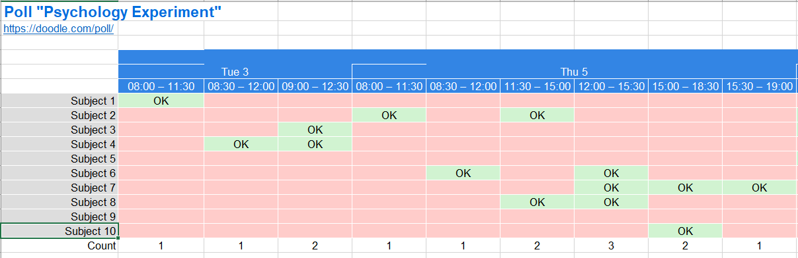

# AutoCalendar :calendar:
**AutoCalendar** is a Python scheduling automation system based on the Google Calendar API ideal for **scheduling research participants**.

For now, there are two main functions:

1. **Automatic allocation** of time slots indicated on a doodle poll (especially useful if participants are told to choose as many available slots as they can).
2. **Add events into Google Calendar** by extracting the relevant information from an excel sheet containing participants' details, such as *date*, *time*, and *location*.

Check out [AutoRemind](https://github.com/zen-juen/AutoRemind) too!


## How to Use

### Automatic Scheduling of Participants

Download your doodle poll into an excel spreadsheet, like so:



For demonstration purposes, we will use the *doodle_poll.xls* file located in the data folder in this repository.
Pass the excel file into the `autoallocate` function.
Here, we set `export_to=False` so that the final dataframe is not exported, but printed in the console (to check before exporting).

```
import autocalendar
file = 'doodle_poll.xls'  
autocalendar.autoallocate(file, allocate_type='multiple', export_to=False)
```
Feedback is provided on whether participants are successfully allocated or not, and the name of any participant who is not allocated will be printed, like so:

```
All participants successfully allocated.

Out[50]: 
        Date      Timeslots      Participant
0   03/11/20  08:00 – 11:30        Subject 1
1   03/11/20  08:30 – 12:00        Subject 4
2   03/11/20  09:00 – 12:30        Subject 3
3   05/11/20  08:00 – 11:30        Subject 2
4   05/11/20  08:30 – 12:00        Subject 6
5   05/11/20  11:30 – 15:00        Subject 8
6   05/11/20  12:00 – 15:30        Subject 6
7   05/11/20  15:00 – 18:30        Subject 7
8   05/11/20  15:30 – 19:00        Subject 7
9   09/11/20  08:00 – 11:30        Subject 5
10  09/11/20  08:30 – 12:00        Subject 4
11  09/11/20  11:30 – 15:00        Subject 3
12  09/11/20  12:00 – 15:30        Subject 3
13  09/11/20  15:00 – 18:30        Subject 7
14  09/11/20  15:30 – 19:00  No One Assigned
15  11/11/20  08:00 – 11:30        Subject 9
16  11/11/20  08:30 – 12:00        Subject 5
17  11/11/20  11:30 – 15:00        Subject 3
18  11/11/20  12:00 – 15:30        Subject 8
19  11/11/20  15:00 – 18:30  No One Assigned
20  11/11/20  15:30 – 19:00  No One Assigned
21  13/11/20  08:00 – 11:30  No One Assigned
22  13/11/20  08:30 – 12:00  No One Assigned
23  13/11/20  11:30 – 15:00       Subject 10
24  13/11/20  12:00 – 15:30        Subject 8
25  13/11/20  15:00 – 18:30       Subject 10
26  13/11/20  15:30 – 19:00       Subject 10
```


### Adding Events into Google Calendar

You will first need to start with a xlsx file containing information on participants' scheduled slots. For example:


For demonstration purposes, we will use the *participant_schedules.xlsx* file located in the data folder in this repository.

Firstly, you would need a `client_secret.json` file: you can do this by going to https://console.developers.google.com/apis/credentials. Click on the 'credentials' tab and then download the client secret file. This will set up OAuth 2.0 so that Google API can be accessed.

```
import autocalendar

# Set up Oauth to access Google API
service = autocalendar.setup_oath(token_path='token.pkl',
                                  client_path='client_secret.json')
```

Then, you can preprocess the input excel sheet (containing participants' scheduled slots). As you may have multiple headers in this file, you can denote which row is the main header row specifying the information we want to extract, using `header_row`.
```
# Read and tidy excel sheet
participants = autocalendar.preprocess_file('participant', header_row=2)
```

The next step is to extract the date, time and location based on header column names in the participants file. Argument `filter_column` can also be activated to `select` only some participants to be added into google calendar. In this example here, we are adding events for only those whom have *No* under the *Calendar_Event* column.

```
# Extract info
dates, start_points, end_points, locations, to_add = autocalendar.extract_info(participants, date_col='Date_Session1', time_col='Timeslot_Session1', location_col='Location_Session1', filter_column='Calendar_Event', select='No')
```

The final step is to prepare the event details and add them into Google Calendar. Argument `calendar_id` (defaults to 'primary') can also be modified according to which active google calendar to use by simply specifying the name of the calendar.

```
# Execute
autocalendar.add_event(service, dates, start_points, end_points, locations, to_add,
                       event_name='MRI study Session 1', description='', timezone='Asia/Singapore',
                       creator_email='mristudy@gmail.com', calendar_id='NTU Calendar',
                       silent=False, name_col='Participant Name', date_col='Date_Session1',
                       location_col='Location_Session1', time_col='Timeslot_Session1')

```

If `silent` in `add_event()` is set to False, you will also get **printed output** on each participant's appointment that is added into Google Calendar!
```
Adding calendar event for Subject1 at 01-01-2021, 11.00am-11.30am, B1-26 
Adding calendar event for Subject2 at 01-01-2021, 10.30am-11.00am, B1-26 
Adding calendar event for Subject3 at 01-01-2021, 4.00pm-4.30pm, B1-26 
Adding calendar event for Subject4 at 02-01-2021, 9.30am-10.00am, B1-26 
Adding calendar event for Subject5 at 02-01-2021, 11.30am-12.00pm, B1-26 
Adding calendar event for Subject6 at 03-01-2021, 12.00pm-12.30pm, B1-26 
```


## Future Direction
- [x] Printed feedback on each event that has been successfully added into calendar
- [ ] Accessibility for longitudinal studies
- [ ] Greater functionality for customizing events by adding arguments from https://developers.google.com/calendar/v3/reference/events
