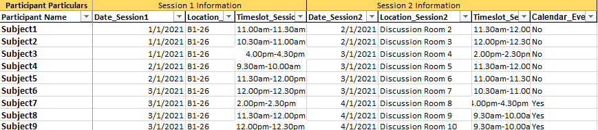

# AutoCalendar :calendar:
**AutoCalendar** is a Python scheduling automation system based on the Google Calendar API ideal for **scheduling research participants**.

Running `autocalendar.py` adds events into Google Calendar by extracting the relevant information from an excel sheet containing participants' details, such as *date*, *time*, and *location*.

Check out [AutoRemind](https://github.com/zen-juen/AutoRemind) too!

## Code Structure
- **Access Google API**: `setup_oauth`
  - Sets up OAuth 2.0
  - You would need a `client_secret.json` file: you can do this by going to https://console.developers.google.com/apis/credentials. Click on the 'credentials' tab and then download the client secret file.
- **Extract event details and create event**:
  - `preprocess_file()`: preprocesses the input excel sheet (containing participants' scheduled slots)
  - `extract_info()`: extracts date, time and location based on header column names in the participants file. Argument `filter_column` can also be activated to select only some participants to be added into google calendar.
  - `create_event()`: prepares event details ready for execution. Argument `calendar_id` (defaults to 'primary') can also be modified according to which active google calendar to use by simply specifying the name of the calendar.

## How to Use

### Input Excel Sheet
You will first need to start with a xlsx file containing information on participants' scheduled slots. For example:




### Modify yourself
Simply download this repository in the same directory where you keep your own participants file, and modify the `def main()` function in `autocalendar.py`.

- Here, change the `date_col`, `time_col`, `location_col` accordingly. This code extracts out only participants where the `Calendar_Event` column is specified as 'No' (`select`) (meaning that their events have not been added yet to the calendar).
```
    dates, start_points, end_points, locations, to_add = extract_info(participants,
                                                                      date_col='Date_Session1',
                                                                      time_col='Timeslot_Session1',
                                                                      location_col='Location_Session1',
                                                                      filter_column='Calendar_Event',
                                                                      select='No')
```

- This code creates the event based on the information output of `extract_info`. Modify the `event_name`, `description` (optional),
`timezone`, `creator_email`, and `calendar_id` accoridngly.

```
        event, calendar_id = create_event(event_name='fMRI study Session 1', description='',
                                          date=dates, start=start_points, end=end_points,
                                          location=locations,
                                          timezone='Asia/Singapore',
                                          creator_email='decisiontask.study@gmail.com',
                                          calendar_id='Lab Use (NTU)')

```

### Run `autocalendar.py`

Run the file and get **printed output** on each participant's appointment that is added into Google Calendar!
```
runfile('C:/Users/Zen Juen/Dropbox/Deception_MockCrime/Deception_MockCrime/Email Automation/autocalendar.py', wdir='C:/Users/Zen Juen/Dropbox/Deception_MockCrime/Deception_MockCrime/Email Automation')

Adding calendar event for Subject1 at 19-10-2020, 10.00am-10.30am, B1-26 
Adding calendar event for Subject2 at 19-10-2020, 10.30am-11.00am, B1-26 
Adding calendar event for Subject3 at 19-10-2020, 11.00am-11.30am, B1-26 
```


## Future Direction
- [x] Printed feedback on each event that has been successfully added into calendar
- [ ] Accessibility for longitudinal studies
- [ ] Greater functionality for customizing events by adding arguments from https://developers.google.com/calendar/v3/reference/events
